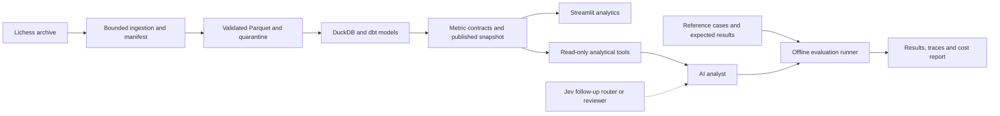

# Chess Analytics Lab — Project Specification and Codex Handoff

Version: 1.0 · Prepared: 2026-10-03 · Status: implementation plan; no application has been built or benchmark run.

This document is self-contained. Place it at `docs/PROJECT_SPEC.md` in a new repository and use the kickoff prompt in section 19 to start implementation. All paths in this document are proposed paths relative to that future repository. The working title and repository name `chess-analytics-lab` are defaults, not an existing repository.

## 1. Purpose and agreed scope

Build a personal portfolio that demonstrates how reliable data engineering supports defensible analytics and measurable AI performance. Use real, publicly accessible chess data. Keep all code, contracts, tests, evaluation definitions, documentation, and small reproducible examples in one repository.

The three initial projects share one system:

1. **Chess data platform:** reproducible ingestion, transformations, quality controls, recovery, and operational evidence.
2. **Opening and time-pressure analytics:** well-defined metrics, comparisons, uncertainty, a dashboard, and written findings.
3. **AI chess-data analyst:** a bounded agent that answers analytical questions using trusted data, with a versioned evaluation suite and reproducible traces.

Follow-up scope: integrate **Jev from TypeSafe AI** for narrow decisions and compare its contribution against simpler alternatives. Keep a personalized training/puzzle recommender on the backlog.

User preferences already established:

- A personal project with the lowest sensible cost; aim for no recurring infrastructure bill.
- Run locally first. A public hosted demo is optional and later.
- OpenAI credits and a Jev login are available. API entitlement and usable balances have not been verified.
- Other credentials may exist through work, but the project must not depend on them. Use personal credentials by default; do not inspect or use workplace keys without explicit authorization for this project.
- Optimize for a polished first release and eventual depth. Develop in dependency order rather than starting every component at once.
- Provide pros, cons, and cost implications for meaningful technology choices.
- Do not require earlier conversations, unrelated projects, or private work artifacts to understand or reproduce this repository.

## 2. Success criteria and portfolio positioning

The completed portfolio should let a reviewer:

- Rebuild a small dataset and its metrics without API credentials.
- See that repeated ingestion does not inflate counts and that interrupted runs do not publish partial results.
- Inspect a metric's grain, denominator, exclusions, and provenance.
- Reproduce at least two analytical findings, including an opening comparison and a clock-pressure investigation.
- Ask supported questions or replay recorded agent examples and inspect the exact data evidence behind each answer.
- Review actual model outcomes, failures, costs, and limitations, separately from tests of the evaluation machinery.

Role relevance:

| Evidence | Skills demonstrated |
|---|---|
| Bounded ingestion, manifests, deduplication, recovery, dbt models | Data engineering and analytics engineering |
| Quality checks, lineage, operational reports, CI | Reliability and production-minded delivery |
| Cohort comparisons, uncertainty, metric definitions, decision memo | Analytical judgment and communication |
| Controlled tool use, evidence-backed answers, reference cases | Applied AI and agent engineering |
| Baseline comparisons, held-out results, cost and error analysis | AI analytics and evaluation |

Example role requirements that informed the design include Python/SQL/dbt/orchestration at [Indicium](https://job-boards.eu.greenhouse.io/indiciumai/jobs/4967990101), agent evaluation sets and rubrics at [Angi](https://jobs.ashbyhq.com/angi/b272e53a-7acd-4ab3-bc62-f37edf8582c7/), and operational performance measurement at [Decagon](https://jobs.ashbyhq.com/decagon/5433ff3a-9a7c-406b-9dd8-23094141b907/). These are examples, not a market census or verified application recommendations.

Portfolio claims must use measured results. Do not invent processing throughput, cost savings, accuracy gains, or scale. A negative benchmark result is still useful evidence.

## 3. Boundaries for the first release

Include batch ingestion, a local analytical database, SQL models, a dashboard, one provider-backed analyst, offline replay, and an evaluation report.

Defer streaming, Kafka, distributed compute, a cloud warehouse, Kubernetes, paid orchestration, a vector database, multi-agent orchestration, authentication for multiple users, and a custom JavaScript frontend. Add a technology only when a documented requirement or measurement justifies it.

Do not train a chess engine, claim causal effects from observational games, identify cheaters, offer assistance during live games, or characterize a player's personality from game records. The analyst explains this dataset; it is not a general chess coach.

Simulation is permitted for labeled test fixtures, corrupt records, retry scenarios, and eventual synthetic product events. Simulated events must never be reported as real player behavior.

## 4. Technology decisions, alternatives, and cost

“$0 locally” means no software/service fee for the planned use on an existing computer. Disk, electricity, internet access, maintenance time, and API consumption still have costs. The following are design recommendations; dependency compatibility must be tested and pinned during setup.

### 4.1 What Streamlit is

Streamlit is an open-source Python framework for building browser-based data apps. We can add a rating filter, opening chart, results table, and chat panel without creating a separate frontend/backend application. It runs on the developer's computer. Its optional Community Cloud hosting is currently free, with resource limits. See [Streamlit documentation](https://docs.streamlit.io/) and [Community Cloud](https://docs.streamlit.io/deploy/streamlit-community-cloud).

Use it as a thin presentation layer: calculations and agent behavior live in importable modules, so the interface can later be replaced. Cache dataset reads; send model requests only after explicit submission, never whenever a filter redraws the page.

### 4.2 Decision matrix

| Area / option | Pros | Cons and hidden cost | Decision |
|---|---|---|---|
| Python, SQL, a locked environment | One primary language; direct data and API support; $0 tool fees | Dependency maintenance and environment setup | Core from the start; choose compatible supported versions |
| DuckDB + local Parquet | Embedded analytics, no database server bill, portable files | Single-machine limits; coordinate writers and publish immutable read snapshots | Default warehouse and storage |
| SQLite | Simple, embedded, $0 | Less suited to this column-oriented analytical workload | No second database initially; use only if a later application requires transactions |
| PostgreSQL | Strong concurrent application database, free local server | Server administration and memory; hosted instances add cost | Deferred until multiple concurrent writers or app transactions require it |
| Snowflake / Databricks / other managed warehouse | Cloud experience and managed scale | Usage, storage, idle resources, trial expiry, and administration | Optional later migration experiment with a specific budget; no assumed free ongoing tier |
| Plain SQL executed from Python | Minimal initial dependencies, $0 | Transformation dependencies and documentation become manual | Use for the first vertical slice only |
| Local open-source dbt with dbt-duckdb | SQL models, tests, lineage, documentation; no hosted subscription needed | Adapter/version compatibility and extra project structure | Add once the first ingestion works; retain for initial portfolio release |
| Simple Python commands | Easy to debug; no daemon or subscription | Weak scheduling UI and operational history unless recorded | First pipeline runner |
| Dagster OSS | Asset dependencies, run UI, partitions and failure visibility without a managed plan | More dependencies; local scheduling requires a running machine/process | Add after tested pipeline functions exist; manual local runs are sufficient |
| Airflow OSS | Familiar scheduler and broad industry usage; no license fee | Heavier operational setup for this small workload | Alternative only if target roles strongly favor it; do not maintain both |
| Streamlit + a Python chart library | Fast dashboard/chat delivery, free local use | Less layout control than a custom frontend; rerun/caching behavior needs care | Default app; start with built-in charts and add one chart library only as needed |
| Notebook or static HTML report | Lowest deployment complexity; no API calls needed to view | Less guided interaction; notebooks can hide execution state | Use for exploration and an exported evidence report, not as the only product |
| React + an API service | Maximum interface control | Two stacks, more testing and maintenance; hosting may add charges | Deferred; limited hiring value relative to effort for this scope |
| Local tests + GitHub Actions | Repeatable checks; standard public-repo hosted runner minutes are free | Private-repo quotas, larger runners, and stored artifacts may incur charges | Small offline CI; local commands remain the source of truth |
| OpenAI API through a small adapter | Existing personal credits; text generation and tool use | Metered tokens, retries, variable latency, changing models | Initial live provider after offline agent tests; record gross cost even if credits cover it |
| Local language model | No per-call provider bill; offline operation possible | Hardware, download, inference time, and quality tradeoffs | Optional later comparison if existing hardware supports it; no GPU purchase planned |
| Jev API | Narrow typed decisions; low published input-token rate | Early product/API evolution; decision accuracy and fit require measurement | Follow-up adapter and benchmark; not a dependency of projects 1–3 |
| Direct SDK calls + local eval files | Few moving parts; provider-neutral benchmark; no evaluation service fee | We own traces, retries, and scoring code | Default agent/eval implementation |
| Agent frameworks / hosted observability | More packaged workflow features | Framework coupling, complexity, possibly hosted fees | Add only if the simple implementation develops a concrete limitation |
| Existing engine annotations | No new engine computation | Incomplete coverage and selection bias | Initial clock/error exploration, explicitly labeled |
| Local Stockfish on a selected subset | Controlled configuration and reproducible enrichment | CPU time, heat, battery, and expanded storage | Later core-depth step; cap positions and compute; never analyze every game by default |

Relevant primary sources: [DuckDB licensing and scope](https://duckdb.org/faq), [dbt introduction](https://docs.getdbt.com/docs/introduction), [dbt-duckdb](https://github.com/duckdb/dbt-duckdb), [Dagster deployment options](https://dagster.io/docs/deployment), and [GitHub Actions billing](https://docs.github.com/en/billing/concepts/product-billing/github-actions). Recheck pricing and supported versions before implementation rather than treating this document as a permanent rate card.

### 4.3 Cost policy

- Target recurring infrastructure spend: **$0** for local development and the offline demo.
- No paid subscriptions, automatic top-ups, cloud resources, or always-on servers are prerequisites.
- Git storage contains code, contracts, small fixtures, and concise reports. Raw archives, full move tables, databases, caches, and bulk traces stay outside Git.
- Start with a maximum 1 GB compressed source download per acquisition job and a 5 GB generated-data allowance. These are adjustable guardrails, not measured requirements. Check free disk and stop before exceeding configured limits.
- Provider calls are disabled in the default configuration. Enabling a live run requires a named model and an explicit run budget. Do not infer a dollar amount from “I have credits.” This does not block any offline development.
- Suggested initial planning ceilings: $1 for a smoke run and $5 for a benchmark, subject to the user's configuration. These are proposals, not spending authorization or estimated bills.
- Reserve an upper-bound cost before each request; cap context, output, steps, and attempts; reconcile with actual usage after responses. Keep a run ledger. Serialize requests initially to avoid concurrent budget races.
- Missing usage or unknown pricing is recorded as unknown, never as zero. A request with uncertain billing retains its reservation until reconciled. Fail closed on further paid work if the remaining budget cannot be established.
- Track gross metered cost and out-of-pocket cost separately. Credits reduce cash paid but do not make an architecture cost-free.
- An optional public demo uses prerecorded responses by default. Do not attach an unrestricted personal API key to anonymous visitors.

Illustrative formula: cost = input tokens × input rate / 1,000,000 + output tokens × output rate / 1,000,000, plus separately priced features if used. Use a dated rate snapshot for the actual provider/model. OpenAI rates vary by model and service; [official pricing](https://developers.openai.com/api/docs/pricing) is the reference.

For Jev, the official model page currently lists **$0.042 per million input tokens and no output-token charge**. At that rate, 1,000 requests with 2,000 total billed input tokens each would be $0.084, before any account-specific conditions. Verify access and billing before a live experiment. [TypeSafe model pricing](https://docs.typesafe.ai/models)

## 5. Data sources and staged acquisition

Primary source: [Lichess open database](https://database.lichess.org/). Standard rated games are distributed as monthly compressed PGN files. PGN is a text notation containing game metadata and moves. These game exports, puzzle data, and position evaluations are CC0. Broadcast exports have a different license and are outside this plan.

A useful starter is January 2013: 121,332 games, 17.8 MB compressed. Clock annotations are documented from April 2017; approximately 6% of standard games include engine evaluations. The first archive is an ingestion fixture, not evidence about contemporary players. [Source details](https://database.lichess.org/)

### 5.1 Dataset tiers

| Tier | Contents | Purpose and limits |
|---|---|---|
| Tiny fixture | 20–100 hand-inspected games plus labeled malformed/test records | Offline CI and independently checkable expected results; not population analysis |
| Foundation corpus | Complete January 2013 standard-game archive | End-to-end ingestion, deduplication, and baseline metrics |
| Analytical demo corpus | Up to 100,000 complete games from a bounded prefix of a fixed newer archive, initially August 2026 | Clock availability and recent examples; a convenience sample with explicit observed date coverage |
| Research corpus | A complete fixed monthly stream sampled by stable game-ID hash, or a documented complete player cohort | Later stronger analysis; requires a larger scan/download even when few records are retained |

Freeze archive month, URL, source bytes/hash, parser version, source ordinal, extraction limits, and inclusion rules. Check the official download listing before selecting a URL. Do not silently move from a missing archive to another source.

The bounded prefix is a deliberate affordability compromise. Display “observed sample,” actual date coverage, and the collection method in every relevant view. Do not estimate platform-wide rates or monthly trends from it. A random sample from the prefix remains a sample of the prefix, not of the full month. Cap by bytes as well as complete games; discard and record an incomplete trailing PGN.

For a complete archive, verify the publisher checksum when available. For a partial stream, hash the retained bytes and extracted records and label them partial; do not claim the full-file checksum passed. Keep the normalized snapshot so repeated analytics do not repeatedly download the source.

Additional sources:

- [Lichess opening names](https://github.com/lichess-org/chess-openings): pin a commit for optional deterministic opening classification and retain its CC0 attribution. Keep provider tags and derived labels separate.
- [Chess.com public API](https://www.chess.com/news/view/published-data-api): optional later ingestion adapter for selected players. Deduplicate by provider plus game ID. Never assume ratings or usernames are directly comparable across platforms.
- Puzzles and bulk engine evaluations: defer downloads until a feature needs them. Do not download the full evaluation corpus for the initial portfolio.

If acquisition fails, proceed with local fixtures and document the unavailable source. Do not substitute synthetic games and label them real.

## 6. Architecture and one-repository layout



Dagster later coordinates the same ingestion, transformation, validation, and publication functions. It must not contain a second implementation of those functions. The app reads a published snapshot, never a half-built working database. A single local writer owns transformations.

Proposed layout:

```text
chess-analytics-lab/
  README.md
  AGENTS.md
  pyproject.toml
  <dependency-lockfile>
  .env.example
  .gitignore
  config/                  # datasets, budgets, model IDs, application settings
  src/chess_analytics/
    ingest/                # acquisition, streaming parser, manifests
    quality/               # validation, quarantine, reconciliation
    warehouse/             # publication and controlled connections
    metrics/               # typed analytical requests, result schemas
    agent/                 # state machine, evidence assembly, tool limits
    providers/             # OpenAI; Jev added later
    evaluation/            # scoring, replay, run reports
    orchestration/         # Dagster adapter added after pipeline works
    cli.py
  dbt/
    models/staging/
    models/intermediate/
    models/marts/
    tests/
  contracts/               # data, metric, answer, tool, and run schemas
  app/                     # Streamlit entry point and pages
  tests/
    unit/
    integration/
    security/
    fixtures/
  evals/
    cases/dev/
    cases/test/
    references/            # expected results and reviewed reference queries
    rubrics/
    manifests/
  docs/
    PROJECT_SPEC.md
    STATUS.md
    DATA_DICTIONARY.md
    METRICS.md
    DECISIONS.md
    RUNBOOK.md
    DEMO.md
  reports/                 # small, reviewed reports suitable for Git
  data/                    # ignored except README; raw/staging/published/cache
  artifacts/               # ignored bulk outputs and model traces
  .github/workflows/
```

Keep this a modular application in one repository, not several services. Add directories when their milestone starts rather than creating empty abstractions. A new database, service, provider, or framework needs a short decision entry describing the problem, alternatives, cost, and measured trigger.

## 7. Data model and contracts

| Table | Grain / key | Important fields and rules |
|---|---|---|
| `source_manifest` | One acquired source version | URL, source period, checksum, partial/full, acquisition limits, observed coverage, parser/config versions |
| `ingestion_run` | One attempt | Run ID, source version, start/end, status, bytes, seen/accepted/rejected/duplicate/conflict counts, duration |
| `fact_game` | One provider/game ID | UTC timestamp when available, result, rated flag, variant, base/increment seconds, original time control, source opening, termination, provenance |
| `fact_player_game` | One game × color | Provider player key, color, rating at that game, opponent rating, result from player's perspective, score 0/0.5/1 |
| `fact_move` | One game × ply | Move index, side, move notation, position reference, clock after move, derived clock before move, nullable engine fields |
| `dim_opening` | One versioned opening identifier | Family, variation, classification source and reference version |
| `fact_engine_evaluation` | One position × engine configuration | Score perspective, cp or mate, depth/nodes, engine/version, origin, status |
| `metric_result` or analytical marts | Declared grain per contract | Numerators, denominators, sample sizes, filters, dataset and metric versions |

Implementation rules:

- Retain ratings on player-game records. Do not overwrite historical ratings with a player's latest value.
- Anonymous/missing players remain unknown. Do not merge all unknown players into one analytical individual.
- Ratings in the Lichess source are Glicko-2 even where the PGN tag contains “Elo.” Use neutral display language such as “rating.”
- One game has two player-game records. Queries must choose game-level or player-level denominators explicitly; joins to moves must not multiply game counts accidentally.
- Use UTC and half-open time windows `[start, end)`. Preserve timestamp precision and missingness rather than inventing midnight for unknown times.
- Initially include standard rated games. Exclude marked bots in analysis and disclose that this does not establish that all remaining players are human.
- Preserve original headers for diagnosis. Missing optional fields are valid; malformed required fields get a quarantine reason.
- Keep source-provided and locally computed evaluations separate. Store mate scores separately from centipawns rather than inventing a finite equivalent.
- Derive opening families from a documented versioned rule or lookup. If a source lacks tags, add the pinned reference classifier before making opening claims.

## 8. Project 1 — reliable data platform

### 8.1 Pipeline behavior

1. Validate a source plan and resource limits; record the plan before acquisition.
2. Download or stream in bounded chunks with timeouts and capped retries.
3. Parse complete PGN games using a chess parser; replay moves to validate legality.
4. Normalize game and participant rows; produce moves only for selected analytical games initially.
5. Detect exact duplicates and conflicting versions independently. Never silently replace a conflicting game record.
6. Write staging outputs, run contract tests and reconciliation, then publish a new snapshot.
7. Update the current-snapshot pointer only after all required checks pass. An interrupted run leaves the prior snapshot usable.

Logical reruns must produce the same keys, values, and metrics; byte-for-byte Parquet equality is not required if serialization metadata differs. A deliberate source or transformation change produces a new version.

### 8.2 Meaningful tests

- Reingest identical records: no new unique games or inflated player counts.
- Interrupt before publication: old snapshot remains queryable; retry matches a clean run.
- Conflicting duplicate: surfaced and withheld pending a documented resolution rule.
- Malformed PGN, illegal move, unsupported variant, missing rating, missing clock, and mate evaluation each exercise distinct outcomes.
- On a complete accepted dataset, exactly two participant rows per game; player scores sum to one; wins equal losses across all participant rows.
- Results, keys, references, and required types are checked in dbt. Reconciliation explains every source record once, with non-overlapping primary dispositions.
- Source drift produces an explicit warning or failure based on severity; added optional headers alone should not destroy ingestion.

### 8.3 Operational evidence

Produce a run report with elapsed time, throughput, peak memory when measurable, disk usage, source coverage, rejected records by reason, and snapshot version. Separate input bytes scanned from bytes retained. A tiny output does not imply a cheap full-source scan.

Dagster adds partition/run visibility after these functions work. Demonstrate an on-demand retry and backfill using local sources. Do not market a replayed batch as a live streaming system or promise unattended execution while the laptop sleeps.

## 9. Project 2 — defensible analytics

### 9.1 Metric definitions

| Metric | Definition | Required cautions |
|---|---|---|
| Game draw rate | Drawn completed eligible games / completed eligible games | Count games once; unknown results excluded and disclosed |
| Player win rate | Wins / (wins + draws + losses) for the selected player perspective | Draws stay in denominator; specify color and rating filters |
| Player score rate | (wins + 0.5 × draws) / completed player-games | Different from win rate; do not relabel |
| Opening usage | Eligible games in an opening family / eligible games with known opening | Report unknown opening fraction separately |
| Rating difference | Player's recorded game rating − opponent's recorded game rating | Do not use later ratings or compare providers directly |
| Evaluation coverage | Eligible moves with usable before/after evaluations / eligible moves | Missing analysis is not zero error |
| Clock-pressure error rate | Moves meeting the versioned error rule / evaluable eligible moves, by clock bucket | Depends on position, rating, phase, and selection into engine analysis |

Keep metric definitions in a local versioned registry, with ID, version, grain, inputs, filters, formula, null rules, units, caveats, and a result schema. A managed semantic-layer subscription is not needed. Tests verify that the registry, SQL, dashboard, and agent use the same definitions.

### 9.2 Opening investigation

Example: compare Sicilian and French Defense results for Black players rated 1400–1599 in a chosen time-control group.

- Start with exact time controls, color, player rating, opponent rating difference, date window, and minimum sample size visible.
- Use a project-defined time-control grouping or exact base+increment. If reproducing Lichess speed categories, verify and pin the source rule; do not guess boundaries.
- Report counts, win/draw/loss and score rates, and uncertainty.
- Adjust descriptively by rating-difference strata using common weights across openings. Remove unsupported strata transparently and report the retained population.
- Use player-cluster resampling where feasible for intervals, since games by the same focal player are dependent. Document remaining opponent dependence and sampling limitations. Do not attach naive move-level independence claims.
- Mark groups with fewer than 100 eligible games as low-support by default; the threshold is a project convention, not a statistical guarantee.
- Report an association for the observed cohort. Opening choice, player experience, and opponent behavior are confounders. Do not claim choosing an opening causes a win-rate increase.

### 9.3 Clock-pressure investigation

Start with a well-supported zero-increment time control to avoid ambiguous timing reconstruction. For moves after a player's first move, the previous recorded clock for that same player provides a pre-turn estimate. Keep first moves and missing/invalid clocks out of timing-derived metrics unless independently validated. For increment games, clock before turn and inferred time spent are distinct fields; validate increment conventions before expanding support.

Initial clock buckets: under 10 seconds, 10–29 seconds, 30–59 seconds, and 60 seconds or more. These are configurable project choices. Show coverage and stratify by rating, time control, and game phase.

Define a centipawn deterioration proxy from comparable before/after evaluations from the mover's perspective: `max(0, score_before − score_after)`. If scores are normalized to White, invert them for Black before comparing. Initial threshold: at least 200 centipawns, explicitly labeled as a project-defined error proxy rather than an official Lichess blunder label. Exclude mate transitions from this scalar measure and count them separately. Source annotations vary in quality, so this is exploratory evidence.

For stronger follow-up evidence, deterministically sample positions without conditioning on existing analysis and evaluate before/after positions with one fixed Stockfish version, NNUE, node budget, threads, and hash setting. Store these settings and cache by canonical position plus configuration. Pilot runtime before choosing the sample size. A default ceiling of 1,000 positions is a limit, not a requirement to fill it. Repeat a sensitivity analysis with a different threshold and, if affordable, engine budget.

### 9.4 Dashboard and written findings

Pages: overview/coverage, opening comparisons, clock-pressure analysis, data quality, AI analyst, and evaluation results. Always display dataset version, observed dates, filters, sample size, and applicable limitations. Use a consistent color palette and accessible labels; make denominators visible near percentages.

Create two short analytical memos: question, method, result, uncertainty, practical interpretation, and what additional data would change the conclusion. If a cohort is too small or evaluations are insufficient, show that finding and choose a supported cohort explicitly rather than fabricating a result.

## 10. Project 3 — AI analyst

The agent answers questions about published data. It must distinguish answering, asking for clarification, and saying the data cannot establish a claim.

### 10.1 Implementation order

1. A deterministic command interface answers typed analytical requests without an LLM.
2. A replay provider returns recorded or clearly labeled fixture responses for development.
3. A live OpenAI adapter interprets questions and calls the same tools.
4. A constrained SQL benchmark track tests more open-ended query generation after the typed path is stable.

Use a small explicit state machine. Keep the model adapter separate from tools, data access, scoring, and the UI. Do not require a multi-agent framework.

### 10.2 Tools and output contract

Proposed tools:

- `list_metrics()` and `get_metric_definition(metric_id)`.
- `get_dataset_coverage()` for actual source limits and available fields.
- `query_metric(metric_id, filters, group_by)` with allowlisted fields and parameterized values.
- `compare_openings(...)` and `analyze_clock_pressure(...)` using reviewed analytical implementations.
- A later `run_readonly_query(sql)` available only inside the restricted benchmark worker.

An answer includes: status (`answered`, `needs_clarification`, `unsupported`, `error`), interpretation, dataset/metric versions, filters, result values, evidence IDs, caveats, and a concise explanation. The UI can render this naturally while retaining structured records for evaluation.

Every quantitative claim should resolve to a result cell or deterministic calculation over an evidence object. The model should not invent percentages from memory. Evidence IDs must exist and match the active dataset. Neither Jev nor another LLM is allowed to certify arithmetic in place of code.

### 10.3 Execution boundaries

- Default tool path uses approved metric functions, not arbitrary Python, shell, or SQL.
- Initial limits: four tool steps, one semantic repair attempt, 30-second tool timeout, 500 returned rows, bounded context/output, and a configured monetary cap. Tune with measurements and record changes.
- Provider transport retries are capped, logged, and charged to the budget; model answer regeneration is separately counted. Never silently choose the best of several answers for a benchmark.
- The SQL track uses an isolated process over a minimal published database with no credentials, unrelated files, or network access. Enforce a read-only connection, statement parsing/allowlisting, allowed relations/functions, no file-reading table functions, no extension loading, no attachment/copy/export, and resource/time limits. Read-only database mode alone is not a complete sandbox.
- Tests must show attempts to read local files, reach the network, load extensions, chain statements, or access unpublished tables fail. If isolation is unavailable, keep free-form SQL disabled and use typed tools.
- Treat game metadata and user-supplied text as data, not instructions. Instructions embedded in names or comments cannot authorize actions.
- No write tool, message-sending tool, or access to unrelated personal/work data is needed.

Record the question, prompt/template version, resolved model version, settings, tool arguments, executed query where relevant, results, errors, attempts, tokens, costs, latency, and final answer. Do not log secrets or request hidden model reasoning.

## 11. Evaluation dataset and experimental design

The evaluation suite is a main deliverable, not a final cosmetic check. Begin it while validating project 2. Until live responses exist, label reports “harness validation,” not “model accuracy.”

### 11.1 Cases and reference answers

Start with 12 deliberately discriminating development cases. Grow to 50 before the full first-release benchmark:

| Category | Cases | Representative issue |
|---|---:|---|
| Basic calculations | 10 | Draw denominator, win rate versus score rate |
| Filters, perspective, and comparisons | 10 | Black versus White, rating boundaries, duplicate joins |
| Multi-step or adjusted analysis | 8 | Common rating weights, comparable populations |
| Ambiguity | 6 | “Best opening,” unspecified rating/color/time control |
| Missing data and unsupported inference | 8 | Missing clocks, sparse groups, causal or training-improvement claims |
| Reliability and access boundaries | 8 | Tool failure, injection text, disallowed access, budget exhaustion |
| **Total** | **50** | |

Use 30 development and 20 held-out cases, with every category represented in both. Split by underlying question/template family, not just paraphrase, to reduce leakage. Additional infrastructure/security tests are outside these 50 cases; do not use easy safety rejections to inflate numerical accuracy.

Every case stores: ID, category, question, snapshot ID, expected status, reference query or deterministic function, expected structured result, tolerance, required caveats, allowed interpretations, severity, rubric version, and split. Distinguish reference queries from runtime tools: the agent never sees expected answers or held-out reference files.

Example shape (illustrative, not a populated case):

```yaml
id: black_opening_score_boundary
category: filtering
dataset_id: <frozen-snapshot-hash>
question: Compare Black's score rate for two opening families at ratings 1400–1599.
expected_status: answered
reference_query: references/black_opening_score_boundary.sql
expected_result_file: references/black_opening_score_boundary.json
comparison:
  counts: exact
  rates_absolute_tolerance: 0.000001
required_caveats:
  - observed_sample_only
  - association_not_causation
split: dev
```

Derive references using independently reviewed SQL and hand-calculated tiny fixtures. At least ten plausible wrong implementations should fail: dropping draws, swapping perspective, counting joined moves as games, off-by-one rating bounds, misusing time windows, treating null evaluations as zero, mixing provider ratings, ignoring source coverage, confusing score and win rate, and using inconsistent adjustment weights. This checks the measuring instrument itself.

### 11.2 Scoring

- **Deterministic:** correct status where unambiguous; integer counts exact; rates checked before display rounding; correct keys, filters, units, source IDs, schemas, and permitted operations. Compare result sets with declared ordering/tie rules, not literal SQL text.
- **Analytical:** blind rubric-based review of supported interpretation, caveats, evidence consistency, and avoidance of causality claims. Automation can flag issues, but ambiguous cases receive human review. Report reviewer identity/process and disagreement when applicable.
- **Operational:** completion, steps, repair attempts, latency, usage, cost, budget handling, and recovery. Report provider failures separately and within an end-to-end denominator so exclusions cannot hide reliability problems.

Separate case types. Numerical accuracy is evaluated on answerable numerical cases; abstention/clarification quality on their own cases. Report counts with rates. A single blended score is optional and cannot replace per-category results.

### 11.3 Baselines and fair experiments

First establish a deterministic reference implementation. Then compare:

1. **Schema-only SQL baseline:** model receives schema and the question, using the restricted SQL track.
2. **Schema + metric semantics:** same model, dataset, tools, and settings; add governed metric definitions. This isolates the semantic-context change.
3. **Product agent:** typed tools, evidence assembly, and bounded repair. This evaluates the complete product; do not attribute its difference solely to semantic context because the tool setup also changes.

Run a small 12-case, two-condition smoke experiment first. For a 50-case, two-condition run, one response per cell means 100 attempts; three repeats mean 300 attempts. Adding a second model doubles those counts. Multi-step calls and retries can make API request counts larger. Estimate costs before choosing breadth or repetitions.

Start with one economical model selected from current official offerings at execution time; pin its available version. Add a higher-capability model only after the first experiment works and if the estimated cost fits. Do not hard-code a “latest” model alias into a published benchmark without recording the resolved version.

Keep all outcomes, including timeouts and failures. Repeat each condition three times for the final variability report if the budget permits; otherwise state that one-shot results do not establish repeatability. Distinguish warm/cold caches and disable response-cache reuse when measuring repeated live behavior.

Freeze the test-set hash, dataset, prompts, and configuration before a held-out run. Developers and coding agents tuning prompts must not inspect held-out expected outputs. Publish the held-out set after the run for reproducibility; once inspected for tuning, retire it from future claims of untouched holdout and create a new version.

Report paired changes by case, category error patterns, run-to-run consistency, and cost per correct answer including failed attempts. Small benchmarks are descriptive; do not claim statistical significance or broad superiority from a few cases.

### 11.4 Proposed release gates

These are engineering targets to freeze before the benchmark, not promised results:

- All offline integrity, reference-validation, and access-boundary tests pass.
- All known high-severity evidence fabrication and unauthorized access cases are handled correctly in the release suite.
- At least 90% numerical correctness on answerable cases overall, with held-out results separately reported and no silent denominator exclusions.
- At least 90% appropriate handling of ambiguity/insufficient-data cases, accompanied by exact counts and manual review of failures.
- Every displayed numerical claim is traceable to executed evidence or an explicit deterministic derived value.
- No unhandled application crashes in the release cases; failures display a useful error state.
- Latency, costs, and variability are reported even if no formal performance target has yet been justified.

If gates are missed, keep the agent labeled experimental, preserve the failure report, and ship the working analytics independently. Do not lower targets after seeing results simply to declare success.

## 12. Jev follow-up portfolio project

### 12.1 Product fit and verified limits

TypeSafe documents Jev as a model for typed decisions over supplied state. Its primitives include Choice, Score, and Noul; it does not generate free-form text. Choice and Score return distributions and confidence; Noul returns a probability. That makes it a candidate for decisions inside the analyst rather than a replacement for SQL, arithmetic, or narrative generation. [Jev introduction](https://docs.typesafe.ai/introduction)

Do not treat “deterministic,” “typed,” “repeatable,” and “correct” as synonyms. The reviewed documentation does not establish a universal bit-for-bit repeatability guarantee. Measure repeated identical requests and perturbations, record the exact model version, and preserve disagreements. TypeSafe also publishes known model limitations. [Model limitations](https://docs.typesafe.ai/model-jaggedness/jev-1.13)

The documented confidence field summarizes a probability distribution; it should not be presented as a direct empirical percentage chance that an answer is correct. Learn decision thresholds on development cases and evaluate them on held-out cases. [Confidence documentation](https://docs.typesafe.ai/confidence)

### 12.2 Integration opportunities in priority order

| Follow-up | What Jev decides | Baseline | Portfolio evidence |
|---|---|---|---|
| **A. Intent and clarification routing — recommended first** | Choose an approved metric family or `clarify` / `unsupported` / `fallback` | Simple rules and an economical LLM classifier | Routing accuracy, unsupported-request recall, fallback rate, end-to-end answer quality, total cost |
| **B. Analytical answer review** | Score whether wording matches evidence; flag unsupported causal interpretation or missing caveats | Explicit checks plus a human-reviewed rubric; optional LLM judge | Detection precision/recall, false rejection rate, disagreement review |
| **C. Cost-aware routing** | Select a deterministic template, small model, or stronger model from a closed set | Always use the economical model; simple rule-based routing | Total cost per correct answer at matched coverage/quality, including Jev overhead |
| **D. Candidate evidence ranking** | Rank a shortlist of metric definitions or relevant examples | Keyword matching over the same shortlist | Retrieval relevance and downstream correctness |

These are proposed experiments, not vendor-supported guarantees of performance on chess analytics. Implement A first, then at most one additional branch if A provides useful evidence.

For A, feed the question, compact metric catalog, and actual coverage summary. A Jev choice can select only a known handler ID. It cannot construct arbitrary SQL, invent a metric ID, or override access limits. Validating filters and executing handlers remains ordinary code. Low-confidence or unsupported decisions fall back or ask a focused clarification; they do not become guessed numerical answers.

For B, pass a compact evidence packet and answer text. Keep exact numerical checks outside Jev. Give each judgment one narrow criterion and combine outputs with visible application rules. Do not use Jev as the sole grader of the system it helps operate.

### 12.3 Experimental protocol

- Create a separate decision dataset of approximately 100 labeled requests/cases, including ambiguity, out-of-scope questions, and missing-data scenarios. Freeze a family-based development/test split before threshold tuning.
- Compare rules, a structured-output LLM, and Jev on identical decision inputs and labels. Also compare the full agent with and without the chosen integration.
- Measure confusion matrices, precision/recall for critical classes, coverage versus error at different thresholds, latency, gross cost, API failures, and repeated-request agreement.
- Use the underlying probabilities for Brier score/reliability plots where meaningful, and note that a small dataset provides weak calibration evidence. Do not substitute the confidence field for the full probability distribution.
- Run equivalent paraphrases and option-order perturbations as robustness tests, separately from identical-request repeatability.
- Define success before the run: useful cost/latency reduction without exceeding a predeclared quality regression allowance. If the test set is too small to establish the tradeoff, label the result exploratory.
- Preserve versioned request schemas, thresholds, resolved model IDs, usage, and fallback reasons. No Jev account is required to replay stored fixtures or run core projects.

A Jev login is not proof of API access or available credits. Verify the personal account's API entitlement and pricing at this milestone. If unavailable, finish the adapter interface and offline contract tests, mark live evaluation blocked, and keep the rest of the repository usable.

## 13. Development sequence and acceptance checks

Effort bands are rough planning estimates for focused work, not deadlines. Adjust after the first vertical slice. Complete each milestone's useful artifact before expanding infrastructure.

| Milestone | Deliverables | Acceptance checks | Rough effort |
|---|---|---|---|
| M0 — Bootstrap | Environment lock, CLI skeleton, tiny fixtures, contracts, status/decisions docs | Fresh environment runs offline smoke test; no paid service dependency | 0.5–1 day |
| M1 — Vertical slice | Acquire small complete archive; parse → Parquet → DuckDB → one metric | Manifest/checksum; hand-checked metric; rerun preserves counts | 1–2 days |
| M2 — Reliable platform | dbt models, quarantine, snapshot publication, recovery tests, operational report; then Dagster | Failure injection and retry match clean run; documented lineage; offline CI | 2–4 days |
| M3 — Analytical corpus and metrics | Bounded newer corpus, coverage report, opening/clock contracts, 12 dev eval cases | Real date/sample limitations visible; independent reference checks | 1–3 days |
| M4 — Analytics product | Dashboard and two analytical memos | Every figure reproducible; denominators, uncertainty and caveats visible | 2–4 days |
| M5 — Agent and eval harness | Typed tools, replay mode, OpenAI adapter, 50-case set, SQL track isolation | Offline end-to-end tests; wrong-query tests; bounded access and spending | 3–5 days |
| M6 — Measured first release | Budgeted live experiment, failure analysis, demo script, reproducible release | Gates reported honestly; model outputs retained; fresh-clone demo works | 1–3 days |
| M7 — Depth | Better sample, controlled engine enrichment, larger independent test set | Measured benefit and resource cost justify each addition | Incremental |
| M8 — Jev follow-up | Routing experiment, optional review/cost-aware extension | Fair baselines, held-out decisions, measured cost/quality tradeoff | After core release |

Dependencies: M0 → M1 → M2 → M3 → M4 → M5 → M6. Draft evaluation cases during M3/M4; do not postpone reference design until the agent exists. M7 and M8 follow the stable core; the recommender remains separate backlog scope.

## 14. Proposed developer and demo commands

These are command-interface requirements to implement, not existing commands:

```text
chesslab doctor                     # environment, disk, config; no secret values
chesslab ingest --dataset foundation
chesslab build --dataset foundation
chesslab validate --dataset foundation
chesslab report --dataset foundation
chesslab demo                       # tiny local dataset + replay; no model bill
chesslab eval --mode replay --split dev
chesslab eval --mode live --config config/experiment.yaml
```

Installing dependencies may require network access once. The offline demo and tests must not need network after installation. A clean checkout must not trigger archive downloads or provider requests merely by importing code or starting tests.

The runbook covers interrupted downloads, malformed sources, disk-limit failures, schema changes, snapshot rollback, provider errors, exhausted budgets, and replaying an evaluation. Recover from existing artifacts when possible rather than re-downloading everything.

## 15. CI, evidence, and reproducibility

CI uses tiny fixtures and replayed responses only. Run lint/type checks as appropriate, parser/contract tests, dbt tests, reference checks, and the restricted-tool boundary suite. Full archives and paid live evals are manual, explicitly configured runs. Avoid persistent large artifacts in GitHub Actions.

Separate testing layers:

- Data tests verify source interpretation and invariants.
- Analytical tests verify metrics against independent small examples.
- Agent tests verify tool selection, output contracts, and error handling.
- Evaluation tests verify that good answers pass and plausible wrong ones fail.
- Live experiments measure a model; unit tests cannot stand in for them.

Each published report includes the Git commit, dataset/contract hashes, model and tool versions, run configuration, hardware where relevant, and reproduction instructions. Preserve raw failures locally and publish a compact redacted evidence bundle. Use aliases for players in public examples unless names are necessary to the analysis; retain source provenance in the local manifest.

Review dependency and data notices before selecting the repository's distribution license. Do not assume that the dataset's CC0 license applies to every software dependency or bundled engine binary. Keep license notices with redistributed components.

## 16. Portfolio delivery and demonstration

README should explain the problem, show the architecture, link to two analytical findings and the evaluation report, and provide a short local setup. Separate achieved behavior from roadmap features.

Five-minute demonstration:

1. Show the data manifest and actual sample coverage.
2. Re-run a small ingestion and show unchanged unique counts.
3. Compare openings with visible color/rating filters and denominators.
4. Show the clock-pressure finding and its coverage caveat.
5. Ask one numerical question, one ambiguous question, and one unanswerable question.
6. Open the numerical answer's query/result evidence and benchmark failure report.

Provide replay mode and a short recording so a hiring reviewer can inspect the project without credentials or waiting for a cloud app. A later hosted Streamlit demo should be small and read-only. Hosting is optional; verify current free-tier limits before deployment.

Suitable portfolio statements are filled in only after measurement, for example: “Built a reproducible chess data platform and evaluated an analytical agent on N frozen cases, retaining per-case evidence and measuring correctness, latency, and metered cost.”

## 17. Deferred backlog and expansion triggers

| Extension | Trigger | Keep out until then |
|---|---|---|
| Personalized training recommender (original project 4) | Stable game features, engine analysis, and independent recommender eval | No puzzle bulk load or recommendation UI |
| Recent representative sampling | Existing demo questions exceed convenience-sample validity | No platform-wide population claims |
| Cloud warehouse migration | A target role or measured scale warrants it and a budget is set | No cloud account dependency |
| Streaming replay | A specific event-time/late-arrival learning objective | No Kafka just for the architecture diagram |
| Synthetic training-product events | A product analytics/experimentation extension needs unavailable events | No synthetic retention or lift reported as real |
| Second data provider | Reconciliation/multi-source learning goal | No cross-provider identity or rating conflation |
| Custom frontend | Streamlit demonstrably prevents a needed interaction | No frontend rebuild for cosmetics alone |

## 18. Decision log, open items, and handoff discipline

No further product clarification is required to start offline M0/M1. Resolve these at the appropriate point:

- At setup: destination repository path/name, machine resource limits, supported dependency versions, and repository visibility when publishing.
- At acquisition: exact newer source URL and the bounded sample's actual coverage.
- Before a live model run: personal API access, model/version, price snapshot, and user-configured spending cap.
- Before Jev evaluation: entitlement, schema/version compatibility, and its separate experiment budget.

Record routine implementation choices in `docs/DECISIONS.md`; do not repeatedly ask the user to choose package versions, directory names, or reversible internals. If a source or tool is blocked, progress on independent offline work and report the actual blocker.

Maintain `docs/STATUS.md` after each milestone: completed acceptance checks with evidence, remaining work, current dataset versions, blockers, and next concrete action. Update this specification if scope changes and record why. Preserve user changes in an existing repository and follow applicable repository instructions.

## 19. Kickoff prompt for a new Codex chat

Copy the following text into a new chat with this document attached or present in the repository:

> Implement Chess Analytics Lab using the attached project specification (or `docs/PROJECT_SPEC.md`) as the complete product and technical brief. Keep projects 1–3 in one repository: a reliable chess data platform, opening/time-pressure analytics, and an evaluated AI analyst. Prioritize minimal personal-project cost and the milestone sequence. Jev integration is a follow-up and the personalized recommender stays on the backlog.
>
> First inspect the repository and applicable AGENTS.md instructions, preserve existing work, and assess the local environment. If this is an empty repository, establish the proposed structure as needed. Start with M0 and M1: a locked environment, tiny offline fixtures, bounded ingestion of the small real dataset, a manifest, and one independently verified metric. Do not start by building all components or provisioning cloud infrastructure.
>
> Use the specification's default decisions unless evidence shows a concrete incompatibility. Document routine choices and proceed. Keep `docs/STATUS.md` and `docs/DECISIONS.md` current so a later chat can continue without conversation history. Each milestone needs meaningful acceptance checks and concise evidence.
>
> Keep live model calls disabled until a personal provider configuration and explicit run spending cap exist. Implement and test the offline path regardless. Never use workplace credentials implicitly. Do not claim benchmark results until actual model responses have been evaluated. Preserve failures and distinguish harness tests, replay results, and live experiments.
>
> Work through the sensible development sequence, communicating completed behavior, verification, material limitations, and the next milestone. Avoid asking again about decisions already made in this specification.

## 20. Source notes and freshness

Technical and pricing sources were consulted on 2026-10-03. Product capabilities, billing, and model IDs can change; recheck them before live integration. Architecture, budgets, thresholds, milestone estimates, and experiments in this document are project proposals, not claims made by vendors.

Primary references are linked beside the relevant claims. Additional implementation references: [OpenAI evaluation guidance](https://developers.openai.com/api/docs/guides/evals), [TypeSafe API documentation](https://docs.typesafe.ai/), and [Streamlit resource management](https://docs.streamlit.io/deploy/streamlit-community-cloud/manage-your-app). The evaluation suite should remain ordinary versioned local files and code, independent of any hosted evaluation product's lifecycle.

## 21. Opening-transposition learning extension — 2026-10-09

The owner approved a maintained research/integration guide and matching static
HTML walkthrough for learning opening strategy through converging move orders.
The delivered guide shares the lab's documentation infrastructure and visual
style. Its two legally replayed example routes illustrate position recognition;
they do not constitute a personalized recommender or measured training result.

The opening game-index milestone now reuses the existing legal ingestion and
immutable DuckDB/Parquet snapshots. It combines eleven sources into 1,295,879
unique accepted games and selects 1,042,346 opening-training games. Require both
players to have known ratings at least 1000, completed results, at least 20 plies,
and no marked bots. Exclude January 2013 from current training. Default to the
240,086-game November 2025 Elite reference cohort (both 2300+, one 2500+, no
bullet), keeping its frequencies separate from the broader 802,260-game cohort.
Use public reference games; personal-history weighting is optional future work.

The implemented October 10 position pass reuses the checked game index, retained
PGNs, legal replay and immutable publication pattern. It records White decisions
at plies 6–20, canonical FEN keys, complete arrival prefixes and observed next
moves. The compact report ranks recurring and transposing boards, reports union
coverage, and breaks down recorded opening families/ECO. The static explorer keeps
Elite and public denominators separate. Strategic lessons, persisted edge models,
Black study and learning evaluation remain future work. The curated Elite month and nine prefixes already
support the first pilot. Further acquisition should follow a measured coverage
need and an explicit byte/processing plan. Keep learning recognition, decision quality, response
time, and mistaken transfer as separate outcomes. The
[design guide](TRANSPOSITION_LEARNING.md) specifies the rationale, limitations,
metrics, and proposed learning experiment.
